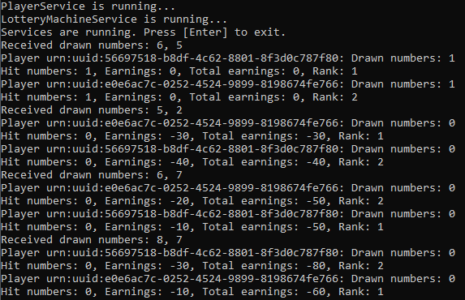
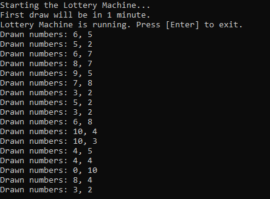
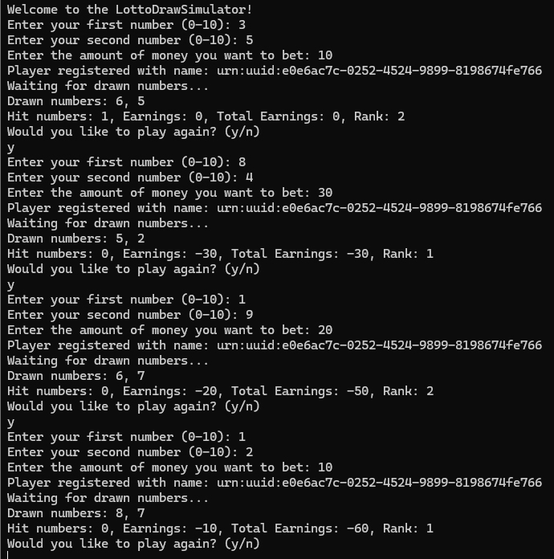

# Lotto Draw Simulator

This project is a WCF service application that simulates drawing lottery numbers. The service allows players to register, place bets, and receive notifications about the drawn numbers. The project consists of two main parts: the `PlayerService` and the `LotteryMachineService`.

## Features

- Players can register by providing two numbers (0-10) and an amount to bet.
- The lottery machine draws random numbers at regular intervals and notifies all registered players.
- Players are notified about the drawn numbers, their hits, earnings, total earnings, and their rank.
- Players can place new bets after each draw.

## Components

### PlayerService

The `PlayerService` manages player registration, tracks player bets and earnings, and notifies players about the draw results.

### LotteryMachineService

The `LotteryMachineService` simulates the drawing of lottery numbers and passes the drawn numbers to the `PlayerService` for processing and notifying players.

### NumberDrawer

A helper class used by the Lottery Machine Client to draw random numbers and send them to the `LotteryMachineService`.


## Usage

### Prerequisites

- .NET Framework or .NET Core
- WCF (Windows Communication Foundation)

### Running the Service Host

1. Navigate to the `LottoDrawSimulator` directory.
2. Build and run the project.
3. The `PlayerService` and `LotteryMachineService` will be hosted and ready to accept requests.



### Running the Lottery Machine Client

1. Navigate to the `LotteryMachineClient` directory.
2. Build and run the project.
3. The Lottery Machine Client will start drawing numbers every minute and sending them to the `LotteryMachineService`.



### Running the Player Client

1. Navigate to the `PlayerClient` directory.
2. Build and run the project.
3. Follow the prompts to register as a player, place bets, and wait for the draw results.



## Example Workflow

1. **Start the Lotto Draw Simulator**: Hosts the `PlayerService` and `LotteryMachineService`.
2. **Run the Lottery Machine Client**: Starts drawing numbers and sending them to the service.
3. **Run the Player Client**: Players can register, place bets, and receive notifications.

## Code Snippets

### Player Registration

```csharp
int number1 = UserInputValidator.GetValidNumber("Enter your first number (0-10): ");
int number2 = UserInputValidator.GetValidNumber("Enter your second number (0-10): ");
decimal amount = UserInputValidator.GetValidAmount("Enter the amount of money you want to bet: ");

string playerName = client.InitPlayer(number1, number2, amount);
if (string.IsNullOrEmpty(playerName))
{
    Console.WriteLine("Player registration failed. Please try again.");
    return;
}
Console.WriteLine($"Player registered with name: {playerName}");
```

### Drawing Numbers

```csharp
int[] drawnNumbers = new int[2];
byte[] randomNumber = new byte[1];
using (var rng = new RNGCryptoServiceProvider())
{
    for (int i = 0; i < 2; i++)
    {
        rng.GetBytes(randomNumber);
        drawnNumbers[i] = randomNumber[0] % 11;
    }
}

Console.WriteLine($"Drawn numbers: {string.Join(", ", drawnNumbers)}");
proxy.ReceiveDrawnNumbers(drawnNumbers);
```

### Notifying Players
```csharp
foreach (var result in playerResults)
{
    if (playerCallbacks.ContainsKey(result.playerName))
    {
        var callback = playerCallbacks[result.playerName];
        callback.NotifyDrawnNumbers(drawnNumbers, result.hitCount, result.earnings, result.totalEarnings, rankedPlayers[result.playerName]);
    }
}
```

# Authors
- Teodor Vidaković - [GitHub](https://github.com/Tekisha)
